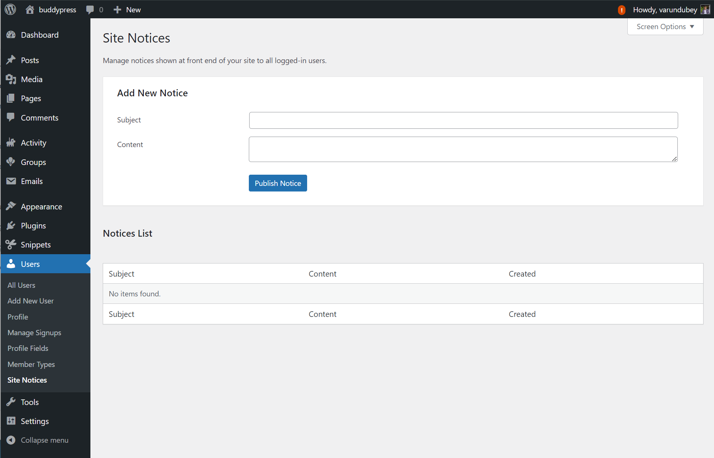
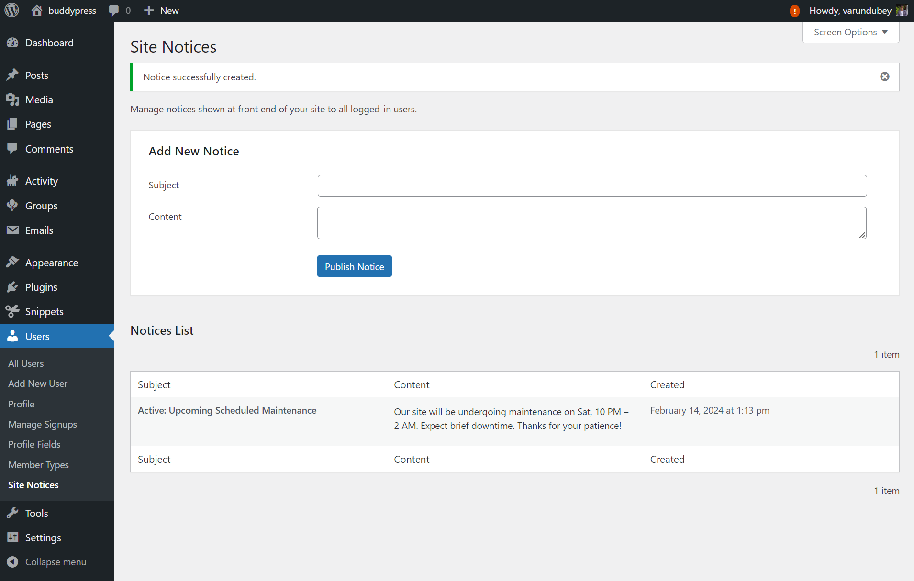
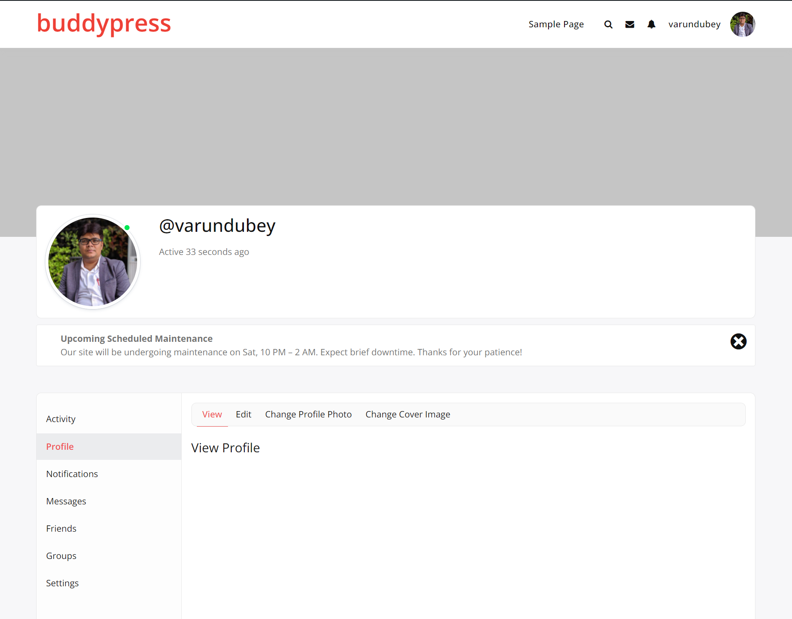
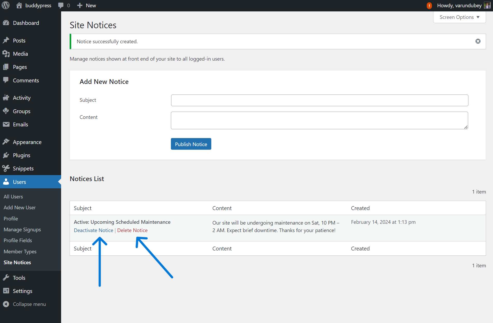

# Sitewide Notices in BuddyPress

Sitewide Notices are a key feature of BuddyPress, enabling site administrators to send important messages to the entire community. These notices are displayed prominently across the site, informing all members about significant updates or announcements.

## Overview

Sitewide Notices are a crucial tool for administrators to relay essential information to all BuddyPress site users, ranging from site maintenance alerts to announcements about community events.

## How to Create Sitewide Notices

Follow these steps to set up a Sitewide Notice:

### Go to the Messages Panel
Log into your WordPress dashboard and navigate to the BuddyPress Messages panel.

### Open the Notices Tab
In the Messages panel, find and select the 'Notices' tab, your central hub for managing Sitewide Notices.

### Add a New Notice
Click the 'Add New' button to begin crafting your notice.

### Draft Your Notice
Write your notice's title and message, striving for clarity and brevity to ensure all members easily understand it.

### Set Your Notice Live
Choose to activate your notice immediately to have it appear sitewide or save it to activate later at a more appropriate time.

## Managing Sitewide Notices

- **Deactivate Notices**: Temporarily remove a notice by deactivating it in the 'Notices' tab, with the option to reactivate it later.

- **Delete Notices**: Remove outdated or unnecessary notices permanently from your system.

## Best Practices

- **Be Clear**: Write direct and easy-to-understand notices to avoid confusion.
- **Stay Relevant**: Ensure your notices are relevant to the entire community to keep them engaging.
- **Time It Right**: Space out your notices to prevent information overload for your users.
- **Reserve for Importance**: Limit Sitewide Notices to messages of significant urgency or importance to maintain their impact.